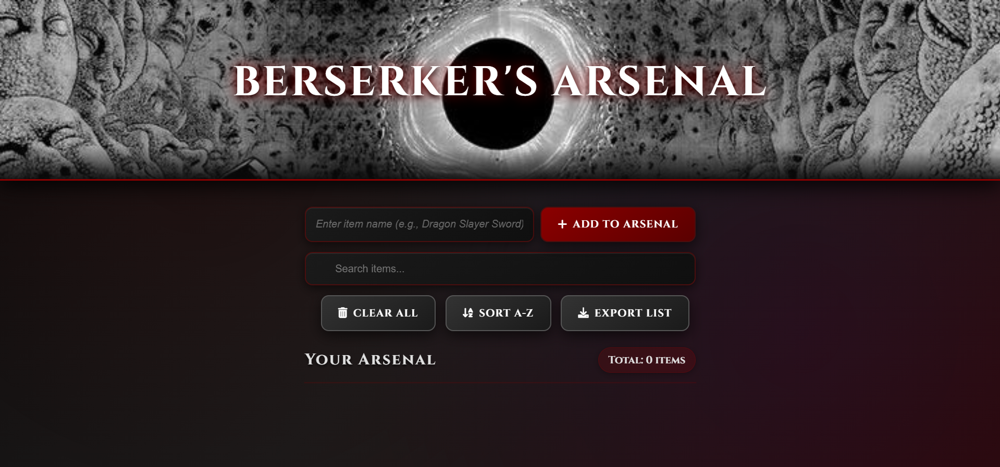
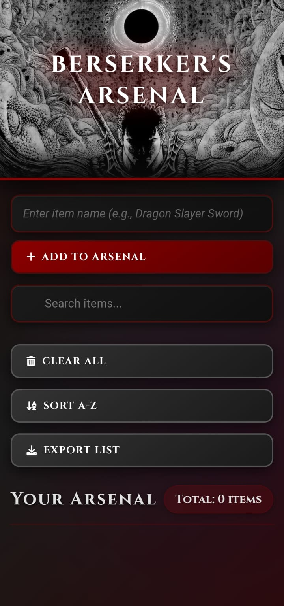

# ⚔️ Berserker's Arsenal

A dark, medieval-themed inventory management application inspired by the legendary manga Berserk. Manage your arsenal of weapons, items, and gear with the fury of the Black Swordsman himself.


<div align="center">
  
  <p><b>Desktop View</b></p>
  
  
  <p><b>Mobile View</b> </p>
</div>

## 🌟 Features

- **🔥 Real-time Synchronization**: Powered by Firebase Realtime Database
- **🔍 Smart Search**: Find your weapons quickly with live search functionality
- **📊 Arsenal Statistics**: Track your total item count in real-time
- **📱 Responsive Design**: Battle-ready on desktop, tablet, and mobile
- **🎨 Dark Theme**: Immersive medieval atmosphere with blood-red accents
- **💾 Export Function**: Download your arsenal as a text file
- **🔤 Smart Sorting**: Alphabetical organization of your items
- **⚔️ Berserk Aesthetic**: Inspired by Kentaro Miura's masterpiece

## 🛠️ Tech Stack

- **Frontend**: Vanilla JavaScript, HTML5, CSS3
- **Backend**: Firebase Realtime Database


## ⚙️ Installation & Setup

### 1. Clone the Repository
```bash
git clone https://github.com/Aaryan-Sharma-5/Guts-Arsenal.git
cd Guts-Arsenal
```

### 2. Firebase Configuration
1. Create a new Firebase project at [Firebase Console](https://console.firebase.google.com/)
2. Enable Realtime Database
3. Set up database rules (see [Security Rules](#-security-rules) section)
4. Update the Firebase configuration in `firebaseConfig.js`:

```javascript
const CONFIG = {
  databaseURL: "your-firebase-database-url-here"
}
```

## 🔒 Security Rules

Configure your Firebase Realtime Database rules:

```json
{
  "rules": {
    "shoppingList": {
      ".read": true,
      ".write": true
    }
  }
}
```

⚠️ **Note**: These rules allow public read/write access. For production, implement proper authentication and security rules.

## 📁 Project Structure

```
Guts-Arsenal/
├── 📂 images/                    # Static assets
│   ├── 🖼️ android-chrome-192x192.png
│   ├── 🖼️ android-chrome-512x512.png
│   ├── 🖼️ apple-touch-icon.png
│   ├── 🖼️ berserk.jpeg           
│   ├── 🖼️ favicon-16x16.png
│   ├── 🖼️ favicon-32x32.png
│   ├── 🖼️ favicon.ico
│   ├── 📸 desktop-view.png       
│   └── 📸 mobile-view.png
├── 📂 css/
│   └── 🎨 style.css              # Main stylesheet
├── 📂 js/
│   ├── 🔧 firebase-config.js     # Firebase configuration
│   └── ⚡ script.js              # Core application logic
├── 📄 .gitignore                 
├── 🏠 index.html                 # Main HTML file
├── 📖 README.md                 
└── 🔧 site.webmanifest         
```

## 🎮 Usage

### Adding Items
1. Enter your weapon or item name in the input field
2. Click "Add to Arsenal" or press Enter
3. Watch as your item appears in real-time

### Managing Arsenal
- **Search**: Use the search bar to filter items
- **Sort**: Click "Sort A-Z" to organize alphabetically
- **Delete**: Click the trash icon next to any item
- **Export**: Download your complete arsenal list
- **Clear All**: Remove all items (with confirmation)

## 🤝 Contributing

I welcome contributions from fellow warriors! Here's how you can help:

### 🎯 Ways to Contribute

- 🐛 **Bug Reports**: Found an issue? [Create an issue](https://github.com/Aaryan-Sharma-5/Guts-Arsenal/issues)
- ✨ **Feature Requests**: Have an idea? [Suggest a feature](https://github.com/Aaryan-Sharma-5/Guts-Arsenal/issues)
- 🔧 **Code Contributions**: Submit pull requests
- 📖 **Documentation**: Improve README or add code comments
- 🎨 **Design**: Suggest UI/UX improvements


## 🔮 Future Enhancements

- [ ] User authentication system
- [ ] Item categories and tags
- [ ] Item quantity tracking
- [ ] Item images support
- [ ] Offline functionality (PWA)

---

<div align="center">

**"In this world, is the destiny of mankind controlled by some transcendental entity or law? Is it like the hand of God hovering above? At least it is true that man has no control, even over his own will."**

*Build your arsenal. Face your demons. Struggle forward.*

**May your code be bug-free and your deploys successful! ⚔️**


</div>

